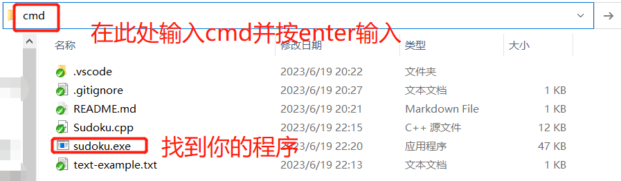
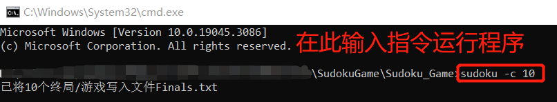

# 数独游戏用户手册

## 1. 程序介绍与概述

### 1.1 程序介绍

该程序是一个数独游戏程序，用于生成数独终局、生成游戏开局、解数独游戏等功能。

### 1.2 安装和配置说明

请使用64-bit Windows 10命令行运行程序。

## 2. 使用指南

### 2.1 运行程序

 1. 请找到sudoku.exe程序所在文件夹，并在此文件夹内运行命令行：

    

 2. 在命令行中输入指令运行程序，具体用法参见下文：

    

### 2.2 参数处理

程序支持以下参数：

- `-c <count>`：生成指定数量（count）的数独终局并保存到文件。
- `-n <count>`：生成指定数量（count）的数独游戏开局。
- `-m <mode>`：设置生成游戏难度模式。
- `-r <range>`：设置生成游戏空格数量（20~55）。
- `-u`：设置生成唯一解的数独游戏开局。
- `-s <filepath>`：从文件加载数独游戏并解局。

### 2.3 生成数独终局

要生成数独终局（终局），请使用以下命令行参数：

```
-c <count>
```

其中，`<count>`为要生成的数独终局数量，范围1~1,000,000。

示例：

```
sudoku -c 10
```

上述命令将生成10个数独终局，并将其保存到文件"Finals.txt"中。

### 2.4 生成数独游戏开局

要生成数独游戏开局，请使用以下命令行参数：

```
-n <count>
```

其中，`<count>`为要生成的数独游戏开局数量，范围1~10,000。

示例：

```
sudoku -n 5
```

上述命令将生成5个数独游戏开局，并将其保存到文件"SudokuGame.txt"中。

### 2.5 生成特定难度的数独游戏开局

要生成特定难度的数独游戏开局，请使用以下命令行参数，注意需要先使用-n参数设定生成的游戏数量：

```
-n <count> -m <mode>
```

其中，`<count>`为要生成的数独游戏开局数量，`<mode>`为游戏难度模式（1-3），默认难度为1。

示例：

```
sudoku -n 5 -m 2
```

上述命令将生成5个中等难度（模式2）的数独游戏开局，并将其保存到文件"SudokuGame.txt"中。

### 2.6 生成特定空格数量的数独游戏开局

要生成特定空格数量的数独游戏开局，请使用以下命令行参数，注意需要先使用-n参数设定生成的游戏数量：

```
-n <count> -r <range>
```

其中，`<count>`为要生成的数独游戏开局数量，`<range>`为空格数量的范围，输入模式：min-max，支持范围：20-55。

示例：

```
sudoku -n 3 -r 22~55
```

上述命令将生成3个空格范围在22至55的数独游戏开局，并将其保存到文件"SudokuGame.txt"中。

### 2.7 生成唯一解的数独游戏开局

要生成唯一解的数独游戏开局，请使用以下命令行参数，注意需要先使用-n参数设定生成的游戏数量：：

```
-n <count> -u
```

其中，`<count>`为要生成的数独游戏开局数量。

示例：

```
sudoku -n 3 -u
```

上述命令将生成3个唯一解的数独游戏开局，并将其保存到文件"SudokuGame.txt"中。

### 2.8 从文件加载数独游戏并求解

要从文件加载数独游戏，请使用以下命令行参数：

```
-s <filepath>
```

其中，`<filepath>`为包含数独游戏的文件路径。

示例：

```
sudoku -s games.txt
```

上述命令将从文件"games.txt"中加载数独游戏，并解局，将解局结果保存至文件"Ans.txt"中。

## 3. 程序扩展

### 3.1 源代码说明

在程序GitHub仓库中存有本程序源代码，为Sudoku.cpp，用户可以根据具体需要在源代码基础上进行直接使用或更改，关于源代码说明请参见代码说明文档。

### 3.2 扩展使用示例

#### 3.2.1 生成终局

```c++
#include "Sudoku.cpp"
Sudoku sdk;
sdk.Gen_Finals(n);//生成n个终局
Save2File(Finals, "Finals.txt");//将终局写入Finals.txt文件中
```

声明数独类对象，使用对象方法生成n个不重复终局到Finals集合中，之后使用存文件函数将集合中数独存入对应文件中（可自定义文件路径）。

#### 3.2.1 生成数独游戏

```c++
#include "Sudoku.cpp"
Sudoku sdk;
sdk.Gen_Finals(n);//生成n个终局
gen_sudokugame(min, max, m, n);//输入挖空范围min~max，难度m(省略为1)，是否唯一解n(省略为0)
Save2File(SudokuGame, "SudokuGame.txt");//将终局写入Finals.txt文件中
```

声明数独类对象，使用对象方法生成n个不重复终局到Finals集合中，然后根据Finals集合中的终局生成游戏存入容器SudokuGame中，最后使用存文件函数将集合中数独存入对应文件中（可自定义文件路径）。

#### 3.2.1解局数独游戏

```c++
#include "Sudoku.cpp"
int n = Load2SdkGame("SudokuGame.txt");//从SudokuGame.txt中读取游戏，数量为n
SovleSdkg();//解局
Save2File(SovledGame, "Ans.txt");//结局结果存入Ans.txt
```

使用读取文件函数从输入路径中读取数独游戏存入容器SudokuGame中，然后调用解局函数针对容器内盘面解局，最后使用存文件函数将集合中数独存入对应文件中（可自定义文件路径）。
